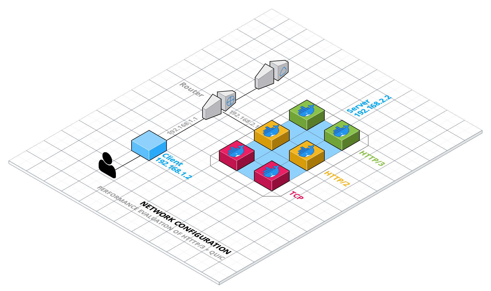

# Performance evaluation of HTTP/3 w/ QUIC

_Suggested software_: Vagrant, OpenVSwitch, docker, or alternatively mininet+docker (Comnetsemu).

_Reference software_: https://blog.cloudflare.com/experiment-with-http-3-using-nginx-and-quiche/

## Table of contents 🗂

-   [Team 👥](#team-)
-   [Overview of the project 🔍](#overview-of-the-project-)
-   [Vagrant configuration 🖥](#vagrant-configuration-)
    -   [Docker images: creation and deployment 🐳](#docker-images--creation-and-deployment-)
        -   [Creation 🧱](#creation-)
        -   [Deployment 🚀](#deployment-)
    -   [Network configuration 🌍](#network-configuration-)
-   [Performance evaluation ⏱](#performance-evaluation-)
    -   [Evaluation criteria ⚖️](#evaluation-criteria-)
-   [Results 🧾](#results-)

## Team 👥

Team members are _Baccichet Giovanni_ (`202869`) and _Parpinello Davide_ (`201494`).

## Overview of the project 🔍

Our task is to build a virtualized framework for analyzing the performance of HTTP/3 w/ QUIC with respect to HTTP/2 and TCP.
In order to do that we figured out that the most efficient way of doing it is, using Vagrant, to create 2 hosts, one of them containing 6 Docker instances.
The first host will be the client used for the performance evaluation, while the other one will be used as server with Docker. The 6 Docker instances will be:

1. Web page over **TCP**;
2. Video streaming over **TCP**;
3. Web page over **HTTP/2**;
4. Video streaming over **HTTP/2**;
5. Web page over **HTTP/3 + QUIC**;
6. Video streaming over **HTTP/3 + QUIC**.

Every instance of the 6 described above will run in the same host, in a separate Docker image, using a different port.



## Vagrant configuration 🖥

As shown in the image above, we decided to create 2 VMs: one for the client that will evaluate the performance of the different protocols, and the other one is for the server, providing the HTMl server and video streaming. The whole configuration, containing the router, the switch and the hosts, can be found in the `Vagrantfile`.

### Docker images: creation and deployment 🐳

In order to simplify the task of creating 6 different configurations for each instance that we want to test, we decided to use docker, setting up 2 different images (one for the web page, the other one for the video streaming) that will be slightly modified to use TCP only, HTTP/2 only or HTTP/3 w/ QUIC only.

| Service         | Protocol      | IP address  | Port |
| --------------- | ------------- | ----------- | ---- |
| Web page        | TCP           | 192.168.2.2 | 81   |
| Video streaming | TCP           | 192.168.2.2 | 82   |
| Web page        | HTTP/2        | 192.168.2.2 | 83   |
| Video streaming | HTTP/2        | 192.168.2.2 | 84   |
| Web page        | HTTP/3 + QUIC | 192.168.2.2 | 85   |
| Video streaming | HTTP/3 + QUIC | 192.168.2.2 | 86   |

As shown in the table above, the IP address is the same across all the Docker instances, begin executed by the same VM. We used ports from 80 to 85 for differentiating each instance.

#### Creation 🧱

The process of creating the docker images consisted in using as sub-system the latest ubuntu image and installing all the software needed for installing NGINX `1.16.1` (necessary for using the quiche patch). All the commands used in this section can be found in the `Dockerfile`.
The dependencies needed are: `curl`, `git`, `libpcre3` and `libpcre3-dev`, `zlib1g` and `zlib1g-dev`, `cargo`, `golang-go`, `build-essential`, `cmake`.

The commands used for patching NGINX are the following (found in the official [Cloudflare's quiche reposotory](https://github.com/cloudflare/quiche), with some minor modification):

```bash
% curl -O https://nginx.org/download/nginx-1.16.1.tar.gz
% tar xzvf nginx-1.16.1.tar.gz
% git clone --recursive https://github.com/cloudflare/quiche
% cd nginx-1.16.1
% patch -p01 < ../quiche/extras/nginx/nginx-1.16.patch
% ./configure                                 \
    --prefix=/etc/nginx                    \
    --sbin-path=/usr/sbin/nginx \
    --modules-path=/usr/lib/nginx/modules \
    --conf-path=/etc/nginx/nginx.conf \
    --error-log-path=/var/log/nginx/error.log \
    --http-log-path=/var/log/nginx/access.log \
    --pid-path=/var/run/nginx.pid \
    --lock-path=/var/run/nginx.lock \
    --http-client-body-temp-path=/var/cache/nginx/client_temp \
    --http-proxy-temp-path=/var/cache/nginx/proxy_temp \
    --http-fastcgi-temp-path=/var/cache/nginx/fastcgi_temp \
    --http-uwsgi-temp-path=/var/cache/nginx/uwsgi_temp \
    --http-scgi-temp-path=/var/cache/nginx/scgi_temp \
    --user=nginx \
    --group=nginx  \
    --build="quiche-$(git --git-dir=../quiche/.git rev-parse --short HEAD)" \
    --with-http_ssl_module                  \
    --with-http_v2_module                   \
    --with-http_v3_module                   \
    --with-openssl=../quiche/deps/boringssl \
    --with-quiche=../quiche
% make
```

In the same guide we found the configuration file that we proceeded to modify with the purpose of customizing the port forwarded outside the container and, most important thing, enabling HTTP/2 or HTTP/3 on demand:

```config
events {
    worker_connections  1024;
}

http {

    server {
        # https://github.com/cloudflare/quiche/tree/master/extras/nginx
        # Enable QUIC and HTTP/3.
        listen 443 quic reuseport;

        # Enable HTTP/2 (optional).
        listen 443 ssl http2;

        server_name localhost.dprojects.it;
        # SSL Certificates generated by us (see below)
        ssl_certificate      fullchain.pem;
        ssl_certificate_key  privkey.pem;

        # Enable all TLS versions (TLSv1.3 is required for QUIC).
        ssl_protocols TLSv1.3;
        ssl_early_data on;

        # Request buffering in not currently supported for HTTP/3.
        proxy_request_buffering off;

        # Add Alt-Svc header to negotiate HTTP/3.
        add_header alt-svc 'h3-29=":443"; ma=86400';

        location / {
            root   html;
            index  index.html index.htm;
        }
    }
}
```

##### SSL Certificate 🔐

As shown at the end of the configuration file, TLS encryption is needed to use the HTTP/3 modded version of NGINX. We did a little bit of research and found out that we couldn't use self-signed SSL certificates with QUIC. Only trusted SSL certificates issued by a CA work.
We used Let's Encrypt for generating a valid SSL/ TLS certificate that works with QUIC, in particular we used the following commands outside Docker and than copied the necessary files inside the container:

```bash
sudo certbot -d localhost.dprojects.it --preferred-challenge dns certonly
cd /etc/letsencrypt/live/localhost.dprojects.it/
```

With these commands we generated `fullchain.pem` and `privkey.pem` than we used said files for the SSL/ TLS encryption of HTTP/2 and HTTP/3, placing them into `/etc/nginx` (using the `COPY` command in the `Dockerfile`).

##### Video streaming mod 📹

The second Docker image (the one responsible for the video streaming) is based on the first one: we modded it installing RTMP module for NGINX (following a [guide](https://www.nginx.com/blog/video-streaming-for-remote-learning-with-nginx/) on the official NGINX website, but using a fork of it, that can be found [here](https://github.com/sergey-dryabzhinsky/nginx-rtmp-module.git)).
The video streaming protocol we decided to use il HLS. We chose it for its large diffusion and for its performance. At first, HLS was exclusive to iPhones, but today almost every device supports this protocol, so it has become a proprietary format. As the name implies, HLS delivers content via standard HTTP web servers. This means that no special infrastructure is needed to deliver HLS content. Any standard web server or CDN will work. Additionally, content is less likely to be blocked by firewalls with this protocol, which is a plus. HLS can play video encoded with the H.264 or HEVC/H.265 codecs.
With all this in mind, we thought it could represent well a real streaming scenario.
For en(de)codig the demo video file we used `ffmpeg`, looping the video for creating a continuous streaming.
We moodified the following section of `nginx.conf`:

```conf
# RTMP configuration
rtmp {
    server {
        listen 1935; # Listen on standard RTMP port
        chunk_size 4000;

        application show {
            live on;
            # Turn on HLS
            hls on;
            hls_path /mnt/hls/;
            hls_fragment 3;
            hls_playlist_length 60;
            # disable consuming the stream from nginx as rtmp
            deny play all;
        }
    }
}

http {
    sendfile off;
    tcp_nopush on;
    aio on;
    directio 512;
    default_type application/octet-stream;

    server {
        listen 8080;

        location / {
            # Disable cache
            add_header 'Cache-Control' 'no-cache';

            # CORS setup
            add_header 'Access-Control-Allow-Origin' '*' always;
            add_header 'Access-Control-Expose-Headers' 'Content-Length';

            # allow CORS preflight requests
            if ($request_method = 'OPTIONS') {
                add_header 'Access-Control-Allow-Origin' '*';
                add_header 'Access-Control-Max-Age' 1728000;
                add_header 'Content-Type' 'text/plain charset=UTF-8';
                add_header 'Content-Length' 0;
                return 204;
            }

            types {
                application/dash+xml mpd;
                application/vnd.apple.mpegurl m3u8;
                video/mp2t ts;
            }

            root /mnt/;
        }
    }
}
```

The last mod we did to the base configuration was to automatically execute the ffmpeg video streaming (without typing every time the following command):

```bash
ffmpeg -re -stream_loop -1 -i /root/big_buck_bunny_720p_10mb.mp4 -vcodec libx264 -vprofile baseline -g 30 -acodec aac -strict -2 -loop -10 -f flv rtmp://localhost/show/stream
```

#### Deployment 🚀

For running the generic images just created, the command to use is:

```bash
docker run --name nginx -d -p 80:80 -p 443:443/tcp -p 443:443/udp -v $PWD/confs/http3.text.nginx.conf:/etc/nginx/nginx.conf nginx-quic
```

Where the tag `-p` is used to map port 80 of the container to port 8080 of the host running said Docker image.
In order to create specific containers for TPC, HTTP/2 and HTTP/3 we just modified the configuration path in the command above. All the different config files are in the `confs` folder.

### Network configuration 🌍

In order to simulate a more realistic scenario, we decided to use different subnets: one for the client (that will do the performance evaluation) and one for the server (that will contain the 6 docker images).
As shown in the image above, the router has 3 interfaces: one for each LAN and one for connecting to the Internet Gateway (Vagrant Management), `eth0`. All the information about the subnets are summarized in the table below:

| Device | Interface | IP address  | Subnet |
| ------ | --------- | ----------- | ------ |
| Router | eth1      | 192.168.1.1 | 1      |
| Client | eth1      | 192.168.1.2 | 1      |
| Router | eth2      | 192.168.2.1 | 2      |
| Server | eth1      | 192.168.2.2 | 2      |

## Performance evaluation ⏱

aaa

### Evaluation criteria ⚖️

aaa

## Results 🧾

aaa
