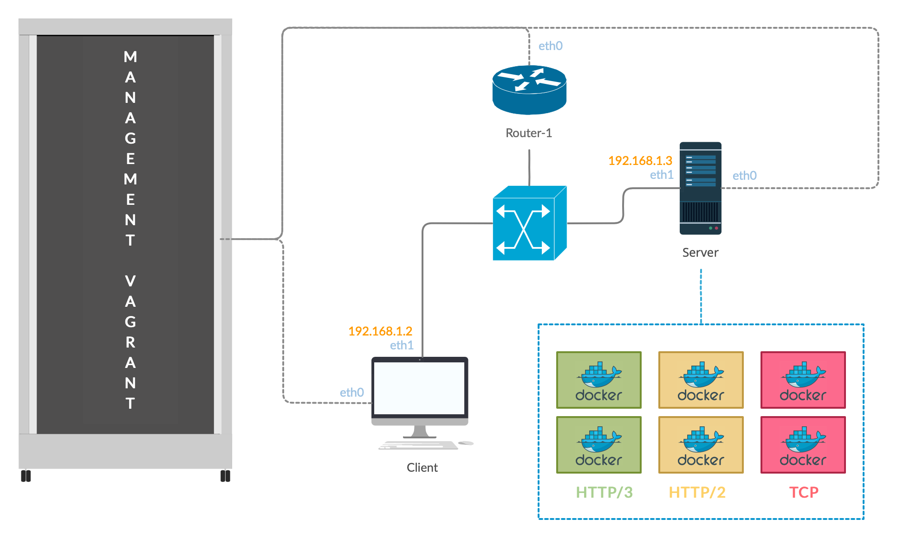

# Performance evaluation of HTTP/3 w/ QUIC

_Suggested software_: Vagrant, OpenVSwitch, docker, or alternatively mininet+docker (Comnetsemu).

_Reference software_: https://blog.cloudflare.com/experiment-with-http-3-using-nginx-and-quiche/

## Team 👥

Team members are _Baccichet Giovanni_ (`202869`) and _Parpinello Davide_ (`201494`).

## Overview of the project 🔍

Our task is to build a virtualized framework for analyzing the performance of HTTP/3 w/ QUIC with respect to HTTP/2 and TCP.
In order to do that we figured out that the most efficient way of doing it is, using Vagrant, to create 2 hosts, one of them containing 6 Docker instances.
The first host will be the client used for the performance evaluation, while the other one will be used as server with Docker. The 6 Docker instances will be:

1. Web page over **TCP**;
2. Video streaming over **TCP**;
3. Web page over **HTTP/2**;
4. Video streaming over **HTTP/2**;
5. Web page over **HTTP/3 + QUIC**;
6. Video streaming over **HTTP/3 + QUIC**.

Every instance of the 6 described above will run in the same host, in a separate Docker image, using a different port.



## Vagrant configuration 🖥

As shown in the image above, we decided to create 2 VMs: one for the client that will evaluate the performance of the different protocols, and the other one is for the server, providing the HTMl server and video streaming. The whole configuration, containing the router, the switch and the hosts, can be found in the `Vagrantfile`.

### Docker images: creation and deployment 🐳

In order to simplify the task of creating 6 different configurations for each instance that we want to test, we decided to use docker, setting up 2 different images (one for the web page, the other one for the video streaming) that will be slightly modified to use TCP only, HTTP/2 only or HTTP/3 w/ QUIC only.

| Service         | Protocol      | IP address  | Port |
| --------------- | ------------- | ----------- | ---- |
| Web page        | TCP           | 192.168.1.3 | 81   |
| Video streaming | TCP           | 192.168.1.3 | 82   |
| Web page        | HTTP/2        | 192.168.1.3 | 83   |
| Video streaming | HTTP/2        | 192.168.1.3 | 84   |
| Web page        | HTTP/3 + QUIC | 192.168.1.3 | 85   |
| Video streaming | HTTP/3 + QUIC | 192.168.1.3 | 86   |

As shown in the table above, the IP address is the same across all the Docker instances, begin executed by the same VM. We used ports from 80 to 85 for differentiating each instance.

#### Creation 🧱

The process of creating the docker images consisted in using as sub-system the latest ubuntu image and installing all the software needed for installing NGINX `1.16.1` (necessary for using the quiche patch). All the commands used in this section can be found in the `Dockerfile`.
The dependencies needed are: `curl`, `git`, `libpcre3` and `libpcre3-dev`, `zlib1g` and `zlib1g-dev`, `cargo`, `golang-go`, `build-essential`, `cmake`.

The commands used for patching NGINX are the following (found in the official [Cloudflare's quiche reposotory](https://github.com/cloudflare/quiche), with some minor modification):

```bash
% curl -O https://nginx.org/download/nginx-1.16.1.tar.gz
% tar xzvf nginx-1.16.1.tar.gz
% git clone --recursive https://github.com/cloudflare/quiche
% cd nginx-1.16.1
% patch -p01 < ../quiche/extras/nginx/nginx-1.16.patch
% ./configure                                 \
    --prefix=/etc/nginx                    \
    --sbin-path=/usr/sbin/nginx \
    --modules-path=/usr/lib/nginx/modules \
    --conf-path=/etc/nginx/nginx.conf \
    --error-log-path=/var/log/nginx/error.log \
    --http-log-path=/var/log/nginx/access.log \
    --pid-path=/var/run/nginx.pid \
    --lock-path=/var/run/nginx.lock \
    --http-client-body-temp-path=/var/cache/nginx/client_temp \
    --http-proxy-temp-path=/var/cache/nginx/proxy_temp \
    --http-fastcgi-temp-path=/var/cache/nginx/fastcgi_temp \
    --http-uwsgi-temp-path=/var/cache/nginx/uwsgi_temp \
    --http-scgi-temp-path=/var/cache/nginx/scgi_temp \
    --user=nginx \
    --group=nginx  \
    --build="quiche-$(git --git-dir=../quiche/.git rev-parse --short HEAD)" \
    --with-http_ssl_module                  \
    --with-http_v2_module                   \
    --with-http_v3_module                   \
    --with-openssl=../quiche/deps/boringssl \
    --with-quiche=../quiche
% make
```

In the same guide we found the configuration file that we proceeded to modify with the purpose of customizing the port forwarded outside the container and, most important thing, enabling HTTP/2 or HTTP/3 on demand:

```config
events {
    worker_connections  1024;
}

http {
    server {
        # Enable QUIC and HTTP/3.
        listen 443 quic reuseport;

        # Enable HTTP/2 (optional).
        listen 443 ssl http2;

        ssl_certificate      cert.crt;
        ssl_certificate_key  cert.key;

        # Enable all TLS versions (TLSv1.3 is required for QUIC).
        ssl_protocols TLSv1 TLSv1.1 TLSv1.2 TLSv1.3;

        # Add Alt-Svc header to negotiate HTTP/3.
        add_header alt-svc 'h3-23=":443"; ma=86400';
    }
}
```

##### SSL Certificate 🔐

As shown at the bottom of the configuration file, TLS encryption is needed to use the HTTP/3 modded version of NGINX. We did a little bit of research and found out that we couldn't use self-signed SSL certificates with QUIC. Only trusted SSL certificates issued by a CA work.
We used Let's Encrypt for generating a valid SSL/ TLS certificate that works with QUIC, in particular we used the following commands outside Docker and than copied the necessary files inside the container:

```bash
sudo certbot -d localhost.dprojects.it --preferred-challenge dns certonly
cd /etc/letsencrypt/live/localhost.dprojects.it/
```

With these commands we generated `fullchain.pem` and `privkey.pem` than we used said files for the SSL/ TLS encryption of HTTP/2 and HTTP/3, placing them into `/etc/nginx` (using the `COPY` command in the `Dockerfile`).

---

The second Docker image (the one responsible for the video streaming) is based on the first one: we modded it using the following commands:

```bash
aaa
```

#### Deployment 🚀

For running the generic images just created the command to use is:

```bash
docker run -it -p 80:8080 quiche-evaluation:1.0
```

Where the tag `-p` is used to map port 80 of the container to port 8080 of the host running said Docker image.
For our purpose, we need to slightly modify the instance of NGINX, for enabling HTTP/2 and HTTP/3 + QUIC and in order to do that we needed to execute the following commands:

```bash
aaa
```

### Network configuration 🌍

aaa

## Performance evaluation ⏱

aaa

### Evaluation criteria ⚖️

aaa

## Results 🧾

aaa
