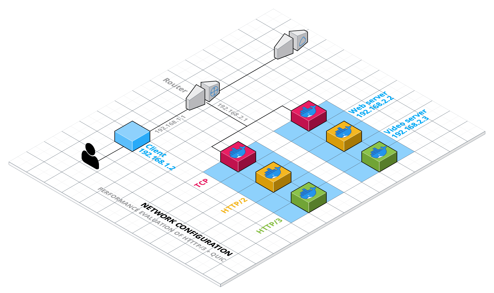

<!-- PROJECT LOGO -->
<br />
<p align="center">
  <a href="https://github.com/GiovanniBaccichet/DNCS-HTTP3">
     
  </a>

  <h3 align="center">Performance Evaluation of HTTP/3 w/ QUIC</h3>

  <p align="center">
    Design of Network and Communication Systems - University of Trento - prof. Fabrizio Granelli
    <br />
    <a href="https://www.bacci.dev"><strong>Download presentation »</strong></a>
    <br />
    <br />
    <a href="https://github.com/GiovanniBaccichet">Giovanni Baccichet</a>
    |
    <a href="https://github.com/davideparpinello">Davide Parpinello</a>
  </p>
</p>

<!-- TABLE OF CONTENTS -->
<details open="open">
  <summary><h2 style="display: inline-block">Table of Contents</h2></summary>
  <ol>
    <li>
      <a href="#about---">About 🔍</a>
      <ul>
        <li><a href="#team">Team</a></li>
        <li><a href="#project">Project</a></li>
      </ul>
    </li>
    <li>
      <a href="#lab-environment---">Lab Environment 🌍</a>
    </li>
    <li><a href="#vagrant-configuration---">Vagrant Configuration 🖥</a></li>
    <li><a href="#docker-configuration---">Docker Configuration 🐳</a>
    <ul>
        <li><a href="#ssl-certificates">SSL Certificates</a></li>
        <li><a href="#web-page-image">Web Page - image</a></li>
        <li><a href="#video-streaming-image">Video Streaming - image</a></li>
        <li><a href="#deployment">Deployment</a></li>
      </ul>
    </li>
    <li><a href="#performance-evaluation--">Performance Evaluation ⏱</a></li>
    <ul>
        <li><a href="#evaluation-criteria">Evaluation Criteria</a></li>
        <li><a href="#results">Results</a></li>
      </ul>
  </ol>
</details>

<!-- ABOUT THE PROJECT -->

## About 🔍

### Team

Team members are **Baccichet Giovanni** (`202869`) and **Parpinello Davide** (`201494`).

### Project

The goal of the project is to build a virtualized framework for analyzing the performance of HTTP/3 + QUIC, with respect to HTTP/2 or TCP.

**Suggested software**: Vagrant, OpenVSwitch, docker, or alternatively mininet+docker (Comnetsemu)
**Reference software**: https://blog.cloudflare.com/experiment-with-http-3-using-nginx-and-quiche/

## Lab Environment 🌍

In order to be as unbiased as possibile, and also to make the performance evaluation replicable by everyone, it is necessary a virtualized lab. More specifically, in the implementation chosen, two softwares are used to set up the environment: **Docker** and **Vagrant**.
In order to replicate a realistic scenario, the setup will be the following: 2 hosts are connected to the same router, but they both belong to different subnets, all of which will be managed by Vagrant. The fist host will be named `client`, and on top of it will run the software needed for the performance evaluation (that will be discussed in a dedicated section). On the other hand, the second host will be called `server` and will run 6 different Docker containers.



For the performance evaluation to be likely realistic, it would have to include both web-page static contents and also video streaming (the most popular medium nowadays). Hence the need of 6 different Docker containers: `(3 protocols to be tested) X (2 kinds of media)`. As said, all containers will run on top of the same host, and so they will have the same IP address. To differentiate one container from the other port forwarding is necessary. The Lab's port configuration is summarized in the table below.

| Service         | Protocol      | IP address  | Ports   |
| --------------- | ------------- | ----------- | ------- |
| Web page        | TCP           | 192.168.2.2 | 81, 451 |
| Web page        | HTTP/2        | 192.168.2.2 | 82, 452 |
| Web page        | HTTP/3 + QUIC | 192.168.2.2 | 80, 443 |
| Video streaming | TCP           | 192.168.2.3 | 84, 454 |
| Video streaming | HTTP/2        | 192.168.2.3 | 85, 455 |
| Video streaming | HTTP/3 + QUIC | 192.168.2.3 | 80, 443 |

Regarding the IP addresses assigned by Vagrant to the different hosts, they are the following: `router::eth1` is `192.168.1.1`, `router::eth2` is `192.168.2.1`, `client::eth1` is `192.168.1.2` and `server::eth2` is `192.168.2.2`.

## Vagrant Configuration 🖥

As showcased earlier, Vagrant is used to manage the VM and networking side of the Lab environment. The imaged used for the OS is `ubuntu/bionic64`.
Some things have to be pointed out: the X11 server is forwarded in order to use performance evaluation tools and browsers form the `client`. This is achieved by adding in the Vagrantfile the following lines:

```Ruby
  config.ssh.forward_agent = true
  config.ssh.forward_x11 = true
```

Also, both the `client` and the `server` have 1024 MB of RAM in order to be capable of running Google Chrome (the first) and ffmpeg (the last).
All the provisioning scripts are in the `vagrant` folder and are used mainly for routing and the installation of basic software.
The provisioning script responsible for the Docker deployment (`docker_run.sh`) is also contained in the same folder as the others, but will be discussed later on.
Last but not least, it is important to know that docker images won't be compiled at each `vagrant up`, but instead downloaded from the [Docker Hub](https://hub.docker.com/u/giovannibaccichet) (which automatically builds them every time something is committed to this repository), in order to save time.

## Docker Configuration 🐳

The approach chosen was to build 2 different Docker images, deploying 6 containers: the first one serves the purpose of running a web-server, whereas the last one is used to stream HLS video. The video-streaming image is a mod of the web-server one and they are both based on NGINX server, more specifically NGINX 1.16.1 (this particular version is needed to run the quiche-patch). In fact both images are pre-configured as HTTP/3 capable, but will be limited in the `nginx.conf` configuration file to run on TCP, HTTP/2 and HTTP/3+QUIC as demanded (in order to complete the performance evaluation).

### SSL Certificates

Since QUIC needs encryption in order to work properly, SSL/TLS certificates had to be generated. After a little bit of research, it turned out that self-signed SSL certificates cannot be used with QUIC: only trusted SSL certificates issued by a CA work.
Let's Encrypt can be used to generate valid certificated, associated with a real domain. Using certbot and DNS verification, the command is the following:

```bash
sudo certbot -d HOSTNAME --manual --preferred-challenges dns certonly
```

And the files needed for NGINX can be found in `/etc/letsencrypt/live/HOSTNAME`.
It is useful to create a subdomain redirecting to `127.0.0.1` (in this case **localhost.bacci.dev**) or `192.168.2.2` (in this case **docker.bacci.dev**) associated with said certificate. This is necessary to connect to the docker containers from the host machine (`127.0.0.1`) or from the `client` inside the Vagrant environment (`192.168.2.2`, or `server` IP address), because as highlighted earlier QUIC accepts only encrypted traffic.
For obvious reasons the certificates used in this performance evaluation are not included in the package, however they can be generated with ease using the command above and passed to docker using the `-v` option (this will be explained in the Deployment section).

### Web Page - image

The web-server image is built form the `Dockerfile_TEXT` that can be found in the `docker` folder. The Linux distro used as subsystem is Ubuntu. After installing all the dependencies and NGINX, the latter is patched using [Cloudflare's quiche patch](https://github.com/cloudflare/quiche).
As reported earlier, the base-image is HTTP/3 capable, but the web-server can run on TCP, HTTP/2 or HTTP/3 as demanded, using the configuration file, passed by the `-v` option in Docker (this will be discussed in the Deployment section). Here's an example of said file:

```Properties
events {
    worker_connections 1024;
}

http {
    server {
        # https://github.com/cloudflare/quiche/tree/master/extras/nginx
        # Enable QUIC and HTTP/3.
        listen 443 quic reuseport;

        # Enable HTTP/2 (optional).
        listen 443 ssl http2;

        server_name localhost.bacci.dev;

        # Certificates generated for localhost.bacci.dev
        ssl_certificate certs/fullchain.pem;
        ssl_certificate_key certs/privkey.pem;

        # Enable all TLS versions (TLSv1.3 is required for QUIC).
        ssl_protocols TLSv1 TLSv1.1 TLSv1.2 TLSv1.3;
        ssl_early_data on;


        # Request buffering in not currently supported for HTTP/3.
        proxy_request_buffering off;

        # Add Alt-Svc header to negotiate HTTP/3.
        add_header alt-svc 'h3-29=":443"; ma=86400';

        location / {
            root html;
            index index.html index.htm;
        }
    }
}
```

NGINX configuration files can be found in the `docker/confs` folder, named after their function: `PROTOCOL.TYPE.nginx.conf`.

### Video Streaming - image

As outlined above, in order to do a comprehensive performance evaluation of HTTP/3 in a realistic scenario, it was necessary to analyze also its video streaming capabilities.
The streaming protocol of choice was HLS because of its large diffusion and for its performance. At first, HLS was exclusive to iPhones, but today almost every device supports this protocol, so it has become a proprietary format. As the name implies, HLS delivers content via standard HTTP web servers. This means that no special infrastructure is needed to deliver HLS content. Any standard web server or CDN will work. Additionally, content is less likely to be blocked by firewalls with this protocol, which is a plus. HLS can play video encoded with the H.264 or HEVC/H.265 codecs.
The video streaming Docker image is just a mod of the one created in the previous section. The only difference is an **RTMP** plugin for NGINX and the installation of **ffmpeg** (used for encoding the video file and looping it, simulating a live streaming). The information necessary to be able to do this mod can be found [here](https://www.nginx.com/blog/video-streaming-for-remote-learning-with-nginx/).
It follows an example of the NGINX's configuration file for the video streaming image:

```Properties
#worker_processes  auto;
events {
    worker_connections 1024;
}

# RTMP configuration
rtmp {
    server {
        listen 1935; # Listen on standard RTMP port
        chunk_size 4000;

        application show {
            live on;
            # Turn on HLS
            hls on;
            hls_path /mnt/hls/;
            hls_fragment 3;
            hls_playlist_length 60;
            # Disable consuming the stream from nginx as rtmp
            deny play all;
        }
    }
}

http {
    server {
        listen 443 quic reuseport;

        listen 443 ssl http2;

        server_name localhost.bacci.dev;

        ssl_certificate certs/fullchain.pem;
        ssl_certificate_key certs/privkey.pem;

        # Enable all TLS versions (TLSv1.3 is required for QUIC).
        ssl_protocols TLSv1 TLSv1.1 TLSv1.2 TLSv1.3;
        ssl_early_data on;


        # Request buffering in not currently supported for HTTP/3.
        proxy_request_buffering off;
        add_header alt-svc 'h3-29=":443"; ma=86400';

        location / {
            # Disable cache
            add_header 'Cache-Control' 'no-cache';

            # CORS setup
            add_header 'Access-Control-Allow-Origin' '*' always;
            add_header 'Access-Control-Expose-Headers' 'Content-Length';

            types {
                # Application/dash+xml mpd;
                application/vnd.apple.mpegurl m3u8;
                video/mp2t ts;
            }
            root /mnt;
        }
    }
}
```

Similarly to the first Docker image, also the later has different configuration files, in order to run on different protocols. Said files are also contained in the `docker/confs` folder.

### Deployment

For the deployment part, there are 2 different alternatives:

1. Build the Docker images and run the containers directly on the host system, using the script `docker_deploy.sh`, which can be found inside the `docker` folder;
2. Launch the Lab Environment discussed earlier with the command `vagrant up`. The latest builded Docker images will be downloaded from the [Docker Hub](https://hub.docker.com/u/giovannibaccichet) and deployed automatically.

Some notes have to be made: in order to change the port configuration used and the SSL/TLS certificates needed, depending on the chosen method of deployment, `docker/docker_deploy.sh` or `vagrant/docker_run.sh` have to be modified.
All ports are parameterized, so the configuration is pretty straight forward:

```bash
# DOCKER RUN PORT SETTINGS
echo "+--------------------------------------------------------+"
echo "|                      PORT SETTINGS                     |"
echo "+--------------------------------------------------------+"

# SET PORTS
# TCP text
h1TEXTp1=81
h1TEXTp2=451
# TCP video
h1VIDEOp1=82
h1VIDEOp2=452
# HTTP/2 text
h2TEXTp1=83
h2TEXTp2=453
# HTTP/2 video
h2VIDEOp1=84
h2VIDEOp2=454
# HTTP/3 text
h3TEXTp1=85
h3TEXTp2=455
# HTTP/3 video
h3VIDEOp1=86
h3VIDEOp2=456
```

While for using custom generated SSL/TLS certificates, it has to be used the following command:

```bash
docker run --name http3-text -d -p $h3TEXTp1:80 -p $h3TEXTp2:443/tcp -p $h3TEXTp2:443/udp -v $PWD/confs/localhost/http3.text.nginx.conf:/etc/nginx/nginx.conf -v $PWD/CERTIFICATES_PATH:/etc/nginx/certs/ quiche-text
```

Replacing `CERTIFICATES_PATH` with the path of the custom ones.

## Performance Evaluation ⏱

### Evaluation Criteria

### Results
